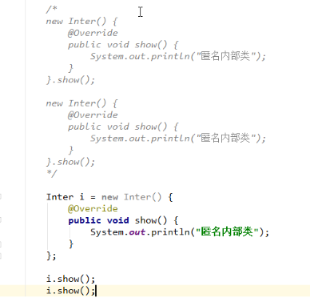

#接口

##接口的描述：

接口就是一种公共的规范标准，只要符合规范标准，大家都可以通用，Java中的接口更多的体现在对行为的抽象

##接口的特点：

接口用关键字interface修饰

public interface 接口名{}

类实现接口用implements表示

public class 类名 implement 接口名{}

接口不能实例化

接口如何实例化呢？参照多态的方式，通过实现类对象实例化，这叫接口多态。

多态的形式：具体类多态，抽象类多态，接口多态。

多态的前提：有继承或者实现关系；有方法重写；有父（类/接口）英勇只想（子/实现）类对象

接口的实现类

要么重写接口中的所有抽象方法

要么是抽象类

##接口的成员特点：

###成员变量

###只能是常量

默认修饰符：public static final

###构造方法

接口没有构造方法，应为接口主要是对行为进行抽象的，是没有具体存在

一个类如果没有父类，默认继承自Object类

###成员方法

只能是抽象方法

默认修饰符：public abstract

#类和接口的关系：

类和类的关系

继承关系，只能单继承，但是可以多层继承

类和接口的关系

实现关系，可以单实线，也可以多实现，还可以在继承一个类的同时实现多个接口

接口和接口的关系

继承关系，可以单继承，也可以多继承

    

#抽象类和接口的区别

成员区别

|抽象类			|变量，常量；有构造方法；有抽象方法，也有非抽象方法。|

|接口				|常量；抽象方法。|
>

关系区别

|类与类			|继承，单继承，多层继承|

|类与接口			|实现，可以单实现，也可以多实现|

|接口与接口		|继承，单继承，多继承|
>

设计理念区别

|抽象类			|对类抽象，包括属性、行为|

|接口				|对行为抽象，主要是行为|
>

形参和返回值

抽象类名作为形参和返回值

方法的形参是抽象类名，其实需要的时该抽象类的子类对象

方法的返回值是抽象类名，其实返回的是该抽象类的子类对象

接口名作为形参和和返回值

方法的形参是接口名，其实需要的是该接口的实现类对象

方法的返回值是接口名，其实返回的是该接口的实现类对象

内部类

内部类：就是在一个类中定义一个类。举例：在一个类A的内部定义一个类B，类B就被称为内部类

pblic class A{

public class B{

}

}

内部类的访问特点：

内部类可以直接访问外部类的成员，包括私有。

外部类要访问内部类的成员，必须创建对象。

成员内部类

按照内部类在类中定义的位置不同，可以分为如下两种形式

在类的成员位置：成员内部类

在类的局部位置：局部内部类

成员内部类，外界如何创建对象使用呢？

格式：外部类名.内部类名 对象名 = 外部类对象.内部类对象；

范例：Outer.Inner oi = new Outer().new Inner();

当成员内部类为私有时，在外部类中创建方法间接调用内部类：

局部内部类

是在方法中定义的类，所以外界是无法直接使用的，需要在方法内部创建对象并使用

该类可以直接访问外部类的成员，也可以访问方法内的局部变量。

匿名内部类

格式：

new 类名或接口名（）{

重写方法；

}；

范例：

new Inter（）{

public void show（）{

}

}；

本质：是一个继承了该类或者实现了该接口的子类匿名对象

调用：

Math,System,Object类的toString(),Object类的equals()

intellIj如何看方法的源码：选中方法，按下Ctrl+B

