# Spring

## 1、Spring是什么

Spring是分层的Java  SE/EE应用full-stack轻量级开源框架，以IoC(Inverse  Of  Control)和 AOP(Aspect  Oriented  Programming面向切面编程)为内核。

提供了展现层SpringMVC和持久层Spring  JDBCTemplate以及业务层事务管理等众多的企业级应用技术，还能整合开源世界众多著名的第三方框架和类库，逐渐成为使用最多的Java EE企业应用开源框架。

## 2、Spring的发展历程

略

## 3、Spring的优势

①方便接偶，简化开发

通过Spring提供的IoC容器，可以将对象的依赖关系交由Spring进行控制，避免硬编码所造成的过度耦合。用户也不必再为了单列模式、属性文件解析等这些很低层的需求写代码，可以更专注于上层的应用。

②AOP编程的支持

通过Spring的AOP功能，方便进行面向切面编程，许多不容易用传统OOP实现的功能可以通过AOP轻松实现。

③声明式事物的支持

可以将我们从单调烦闷的事务管理代码中解脱出来，通过声明方式灵活的进行事务管理，提高开发效率。

④方便程序的测试

可以用非容器依赖的编程方式进行几乎所有的测试工作，测试不再是昂贵的操作，而是随手可做的事情。

⑤方便集成各种优秀的框架

Spring对各种优秀框架（Struts、Hibernate、Hessian、Quartz等）的支持。

⑥降低JavaEE  API的使用难度

Spring对JavaEE  API（如JDBC、JavaMail、远程调用等）进行了薄薄的封装，使这些API的使用难度大为降低。

⑦Java源码是经典学习范例

Spring的源代码设计精妙、结构清晰、匠心独用，处处体现着大师对Java设计模式灵活运用以及对Java技术的高深造诣。它的源代码无疑是Java技术的最佳实践的范例。

## 4、Spring的体系结构

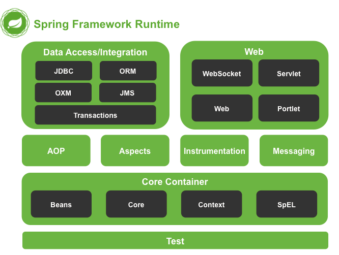

Instrumentation（仪表）

## 5、Spring快速入门

### 5.1、Spring程序开发步骤


①使用Maven导入Spring开发的基本jar包

②编写Dao接口和实现类

③创建Spring核心配置文件

④在Spring配置文件中配置UserDaoImpl

⑤使用Spring的API获得Bean实例

### 5.2、Spring快速入门代码实现

Spring的开发步骤

①导入jar包

②创建Bean

③创建applicationContext.xml

④在配置文件中进行配置

⑤创建ApplicationContext对象getBean

## 6、Spring配置文件

### 6.1、Bean标签的基本配置

用于配置对象交由Spring来创建

默认情况下它调用的是类中的无参构造函数，如果没有无参构造函数则不能创建成功


基本属性：

- id：Bean实例在Spring容器中的唯一表示

- class：Bean的全限定名称

### 6.2、Bean标签范围配置

scope：指对象的作用范围，取值如下：


①当scope的取值为singleton时

Bean的实例化个数：1个

Bean的实例化时机：当Spring核心文件被加载时，实例化配置的Bean实例

Bean的生命周期：

- 对象创建：当应用加载，创建容器时，对象就被创建了

- 对象运行：只要容器在，对象一直活着

- 对象销毁：当应用卸载，销毁容器时，对象就被销毁了

②当scope的取值为prototype时

Bean的实例化个数：多个

Bean的实例化时机：当调用getBean()方法时实例化Bean

Bean的生命周期：

- 对象创建：当使用对象时，创建新的对象实例

- 对象运行：只要对象在使用中，就一直或者

- 对象销毁：当对象长时间不用时，被Java的垃圾回收器(GC)回收了

### 6.3、Bean生命周期配置

- init-method：指定类中的初始化方法名称

- destroy-mothod：指定类中销毁方法名称

### 6.4、Bean实例化三种方式

- 无参构造方法实例化（最常用）

- 工厂静态方法实例化

- 工厂实例方法实例化

### 6.5、Bean的依赖注入分析

目前UserService实例和UserDao实例都存在与Spring容器中，当前的做法时在容器外部获得UserService实例和UserDao实例，然后在程序中进行结合。

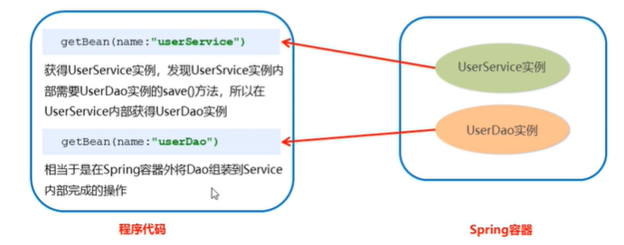

因为UserService和UserDao都在Spring容器中，而最终程序直接使用的时UserService，所以可以在Spring容器中，将UserDao设置到UserService内部。


### 6.6、Bean的依赖注入概念

依赖注入（Dependency Injection）：它是Spring框架核心IOC的具体实现。

在编写程序时，通过控制反转，把对象的创建交给了Spring，但是代码中不可能出现没有依赖的情况。IOC解耦只是降低他们的依赖关系，但不会消除。例如：业务层仍会调用持久层的方法。

那这种业务层和持久层的依赖关系，在使用Spring之后，就让Spring来维护了。

简单的说，就是坐等框架把持久层对象传入业务层，而不用我们自己去获取。

如何将UserDao注入到UserService内部呢？

- set方法

- 构造方法

具体实现为：

- set方法

1）set方法①

```
<bean id="userService" class="com.company.SpringIoC.service.impl.UserServiceImpl">
        <property name="userDao" ref="userDao"></property>
</bean>
```

```
/**
 * @description:
 * @author: Kblayt
 * @time: 2022/5/26 15:12
 */
public class UserServiceImpl implements UserService {

    private UserDao userDao;

    public void setUserDao(UserDao userDao) {
        this.userDao = userDao;
    }

    @Override
    public void save() {
        userDao.save();
    }
}
```

2）set方法②

P命名空间注入本质也是set方法注入，但比起上述的set方法注入更加方便，主要体现在配置文件中，如下：

首先，需要引入P命名空间：

```
xmlns:p="http://www.springframework.org/schema/p"
```

其次，需要修改注入方式

```
<bean id="userService" class="com.company.SpringIoC.service.impl.UserServiceImpl" p:userDao-ref="userDao"/>
```

- 构造方法

```
<bean id="userService" class="com.company.SpringIoC.service.impl.UserServiceImpl">
        <constructor-arg name="userDao" ref="userDao"></constructor-arg>
</bean>
```


```
/**
 * @description:
 * @author: Kblayt
 * @time: 2022/5/26 15:12
 */
public class UserServiceImpl implements UserService {

    private UserDao userDao;

    public UserServiceImpl(UserDao userDao) {
        this.userDao = userDao;
    }

    public UserServiceImpl() {
    }

    @Override
    public void save() {
        userDao.save();
    }
}

```

### 6.7、Bean的依赖注入的数据类型

上面的操作，都是注入的引用Bean，除了对象的引用可以注入，普通数据类型或集合都可以在容器中进行注入

注入数据的三种数据类型

- 普通数据类型

- 引用数据类型(UserDao引用注入到UserService，就是对象引用数据类型注入，6.6已讲)

- 集合数据类型

具体实现为：

- 普通数据类型

```
<bean id="userDao" class="com.company.SpringIoC.dao.impl.UserDaoImpl">
        <property name="age" value="18"></property>
        <property name="name" value="lhg"></property>
</bean>
```

```
/**
 * @description:
 * @author: Kblayt
 * @time: 2022/5/26 14:22
 */
public class UserDaoImpl implements UserDao {

    private String name;
    private int age;

    public void setName(String name) {
        this.name = name;
    }

    public void setAge(int age) {
        this.age = age;
    }

    @Override
    public void save() {
        System.out.println(name+"==="+age);
    }
}
```

- 集合数据类型


```
/**
 * @description:
 * @author: Kblayt
 * @time: 2022/5/26 14:22
 */
public class UserDaoImpl implements UserDao {

    private List<String> strList;
    private Map<String,User> userMap;
    private Properties properties;

    public void setStrList(List<String> strList) {
        this.strList = strList;
    }

    public void setUserMap(Map<String, User> userMap) {
        this.userMap = userMap;
    }

    public void setProperties(Properties properties) {
        this.properties = properties;
    }

    @Override
    public void save() {
        System.out.println(strList);
        System.out.println(userMap);
        System.out.println(properties);
    }
}

```

```
<bean id="userService" class="com.company.SpringIoC.service.impl.UserServiceImpl">
        <constructor-arg name="userDao" ref="userDao"></constructor-arg>
</bean>
<bean id="userDao" class="com.company.SpringIoC.dao.impl.UserDaoImpl">
        <property name="strList">
                <list>
                        <value>aaa</value>
                        <value>bbb</value>
                        <value>ccc</value>
                </list>
        </property>
        <property name="userMap">
                <map>
                        <entry key="u1" value-ref="user1"></entry>
                        <entry key="u2" value-ref="user2"></entry>
                </map>
        </property>
        <property name="properties">
                <props>
                        <prop key="p1">111</prop>
                        <prop key="p2">222</prop>
                        <prop key="p3">333</prop>
                </props>
        </property>
</bean>
<bean id="user1" class="com.company.SpringIoC.pojo.User">
        <property name="name" value="tom"></property>
        <property name="addr" value="hunan"></property>
</bean>
<bean id="user2" class="com.company.SpringIoC.pojo.User">
        <property name="name" value="lucy"></property>
        <property name="addr" value="beijing"></property>
</bean>

```


### 6.8、引入其他配置文件(分模块开发)

实际开发中，Spring的配置内容非常多，这就导致Spring配置很繁杂且体积很大，所以，可以将部分配置拆解到其他配置文件中，而在Spring主配置文件通过import标签进行加载。

```
<import resource="applicationContext-xxx.xml">
```

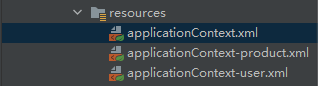

applicationContext.xml引用applicationContext-product.xml和applicationContext-user.xml

```
<?xml version="1.0" encoding="UTF-8"?>
<beans xmlns="http://www.springframework.org/schema/beans"
       xmlns:xsi="http://www.w3.org/2001/XMLSchema-instance"
       xmlns:p="http://www.springframework.org/schema/p"
       xsi:schemaLocation="http://www.springframework.org/schema/beans http://www.springframework.org/schema/beans/spring-beans.xsd">

        <import resource="applicationContext-product.xml"></import>
        <import resource="applicationContext-user.xml"></import>

</beans>
```

### 6.9、Spring的重点配置知识要点


## 7、Spring相关API

### 7.1、ApplicationContext的继承体系

Diagram


### 7.2、ApplicationContext的实现类

①ClassPathXmlApplicationContext

它是从类的根路径下加载配置文件推荐使用这种

②FileSystemXmlApplicationContext

它是从磁盘路径上加载配置文件，配置文件可以在磁盘的任意位置

③AnnotationConfigApplicationContext

当使用注解配置容器对象时，需要使用此类来创建spring容器。它用来读取注解。

### 7.3、getBean()方法的使用

主要学习使根据d获取和根据类型获取


## 8、Spring配置数据源

### 8.1、数据源（连接池）的作用

- 数据源(连接池)是提高程序性能而出现的

- 事先实例化数据源，初始化部分连接资源

- 使用连接资源时从数据源中获取

- 使用完毕后将连接资源归还给数据源

常见的数据源(连接池)：DBCP、C3P0、BoneCP、Druid等

### 8.2、数据源的开发步骤

①导入数据源的坐标和数据库驱动坐标

②创建数据源对象

③设置数据源的基本连接数据

④使用数据源获取连接资源和归还连接资源

### 8.3、数据源的手动创建

```
package com.company.SpringIoC_anno;

import com.alibaba.druid.pool.DruidDataSource;
import com.mchange.v2.c3p0.ComboPooledDataSource;
import org.junit.Test;

import java.beans.PropertyVetoException;
import java.sql.Connection;
import java.util.ResourceBundle;

/**
 * @description:
 * @author: Kblayt
 * @time: 2022/5/27 14:12
 */
public class DataSourceTest {

    @Test
    //测试手动创建c3p0数据源
    public void test1() throws Exception {
        ComboPooledDataSource dataSource = new ComboPooledDataSource();
        dataSource.setDriverClass("com.mysql.cj.jdbc.Driver");
        dataSource.setJdbcUrl("jdbc:mysql://localhost:3306/javaweb");
        dataSource.setUser("root");
        dataSource.setPassword("123456");
        Connection connection = dataSource.getConnection();
        System.out.println(connection);
        connection.close();
    }

    @Test
    //测试手动创建druid数据源
    public void test2() throws Exception {
        DruidDataSource dataSource = new DruidDataSource();
        dataSource.setDriverClassName("com.mysql.cj.jdbc.Driver");
        dataSource.setUrl("jdbc:mysql://localhost:3306/javaweb");
        dataSource.setUsername("root");
        dataSource.setPassword("123456");
        Connection connection = dataSource.getConnection();
        System.out.println(connection);
        connection.close();
    }

    @Test
    //测试手动创建c3p0数据源(加载properties配置文件)
    public void test3() throws Exception {
        //读取配置文件
        ResourceBundle resourceBundle = ResourceBundle.getBundle("jdbc");
        String driver = resourceBundle.getString("jdbc.driver");
        String url = resourceBundle.getString("jdbc.url");
        String username = resourceBundle.getString("jdbc.username");
        String password = resourceBundle.getString("jdbc.password");
        //创建数据源对象 设置连接参数
        ComboPooledDataSource dataSource = new ComboPooledDataSource();
        dataSource.setDriverClass(driver);
        dataSource.setJdbcUrl(url);
        dataSource.setUser(username);
        dataSource.setPassword(password);
        Connection connection = dataSource.getConnection();
        System.out.println(connection);
        connection.close();
    }
}
```

jdbc.properties

```
jdbc.driver=com.mysql.cj.jdbc.Driver
jdbc.url=jdbc:mysql://localhost:3306/javaweb
jdbc.username=root
jdbc.password=123456
```


### 8.4、Spring配置数据源

可以将DataSource的创建权交由Spring容器去完成

```
package com.company.SpringIoC_anno;

import com.alibaba.druid.pool.DruidDataSource;
import com.mchange.v2.c3p0.ComboPooledDataSource;
import org.junit.Test;
import org.springframework.context.ApplicationContext;
import org.springframework.context.support.ClassPathXmlApplicationContext;

import javax.sql.DataSource;
import java.sql.Connection;
import java.util.ResourceBundle;

/**
 * @description:
 * @author: Kblayt
 * @time: 2022/5/27 14:12
 */
public class DataSourceTest {
    @Test
    //测试Spring容器产生数据源对象
    public void test4() throws Exception {
        ApplicationContext applicationContext = new ClassPathXmlApplicationContext("applicationContext.xml");
        DataSource dataSource = applicationContext.getBean(DataSource.class);
        Connection connection = dataSource.getConnection();
        System.out.println(connection);
        connection.close();
    }
}

```

applicationContext.xml

```
<?xml version="1.0" encoding="UTF-8"?>
<beans xmlns="http://www.springframework.org/schema/beans"
       xmlns:xsi="http://www.w3.org/2001/XMLSchema-instance"
       xsi:schemaLocation="http://www.springframework.org/schema/beans http://www.springframework.org/schema/beans/spring-beans.xsd">

    <bean id="dataSource" class="com.mchange.v2.c3p0.ComboPooledDataSource">
        <property name="driverClass" value="com.mysql.cj.jdbc.Driver"></property>
        <property name="jdbcUrl" value="jdbc:mysql://localhost:3306/javaweb"></property>
        <property name="user" value="root"></property>
        <property name="password" value="123456"></property>
    </bean>

</beans>
```

### 8.5、抽取jdbc配置文件

applicationContext.xml加载jdbc.properties配置文件获得连接信息（Spring容器加载properties文件）


首先，需要引入context命名控件和约束路径：

- 命名空间：xmlns:context="http://www.springframework.org/schema/context"

- 约束路径：http://www.springframework.org/schema/context

  http://www.springframework.org/schema/context/spring-context.xsd

再将外部properties文件使用context:property-placeholder标签加载到applicationContext.xml中来。

最后使用EL表达式调用对应值

```
<?xml version="1.0" encoding="UTF-8"?>
<beans xmlns="http://www.springframework.org/schema/beans"
       xmlns:xsi="http://www.w3.org/2001/XMLSchema-instance"
       xmlns:context="http://www.springframework.org/schema/context"
       xsi:schemaLocation="http://www.springframework.org/schema/beans http://www.springframework.org/schema/beans/spring-beans.xsd
                            http://www.springframework.org/schema/contxt http://www.springframework.org/schema/context/spring-context.xsd">
    
<!--加载外部的properties文件-->
    <context:property-placeholder location="classpath:jdbc.properties"></context:property-placeholder>

    <bean id="dataSource" class="com.mchange.v2.c3p0.ComboPooledDataSource">
        <property name="driverClass" value="${jdbc.driver}"></property>
        <property name="jdbcUrl" value="${jdbc.url}"></property>
        <property name="user" value="${jdbc.username}"></property>
        <property name="password" value="${jdbc.password}"></property>
    </bean>

</beans>
```


## 9、Spring注解开发

### 9.1、Spring原始注解

Spring是轻代码而重配置的框架，配置比较繁重，影响开发效率，所以注解开发是一种趋势，注解代替xml配置文件可以简化配置，提高开发效率。

Spring原始注解主要是替代<Bean>的配置

| 注解 | 说明 |
| - | - |
| @Component | 使用在类上用于实例化Bean |
| @Controller | 使用在web层类上用于实例化Bean |
| @Service | 使用在service层类上用于实例化Bean |
| @Repository | 使用在dao层类上用于实例化Bean |
| @Autowired | 使用在字段上用于根据类型依赖注入 |
| @Qualifier | 结合@Autowired一起使用用于根据名称进行依赖注入 |
| @Resource | 相当于@Autowired+@Qualifier，按照名称进行注入 |
| @Value | 注入普通属性 |
| @Scope | 标注Bean的作用范围 |
| @PostConstruct | 使用在方法上标注该方法是Bean的初始化方法 |
| @PreDestroy | 使用在方法上标注该方法时Bean的销毁方法 |


在使用注解开发时，需要使用在applicationContext.xml中配置组件扫描。

```
<?xml version="1.0" encoding="UTF-8"?>
<beans xmlns="http://www.springframework.org/schema/beans"
       xmlns:xsi="http://www.w3.org/2001/XMLSchema-instance"
       xmlns:context="http://www.springframework.org/schema/context"
       xsi:schemaLocation="http://www.springframework.org/schema/beans http://www.springframework.org/schema/beans/spring-beans.xsd
       http://www.springframework.org/schema/context http://www.springframework.org/schema/context/spring-context.xsd
">
<!--配置组件扫描-->
    <context:component-scan base-package="com.company.SpringIoC_anno"></context:component-scan>

</beans>
```

### 9.2、Spring新注解

使用上面的注解还不能全部代替xml配置文件，还需要使用注解替代的配置如下：

- 非自定义的Bean的配置：<bean>

- 加载properties文件的配置：<context:property-placeholder>

- 组件扫描的配置：<context:component-scan>

- 引入其他文件：<import>

| 注解 | 说明 |
| - | - |
| @Configuration | 用于指定当前类是一个Spring配置类，当前创建容器时会从该类上加载注解 |
| @ComponentScan | 用于指定Spring在初始化容器时要扫描的包。<br>作用和在Spring的xml配置文件中的&lt;context:component-scan base-package="com.company.SpringIoC\_anno"/&gt;一样 |
| @Bean | 使用在方法上，标注将该方法的返回值存储Spring容器中 |
| @PropertySource | 用于加载properties文件中的配置 |
| @Import | 用于导入其他配置类 |


## 10、Srping集成Junit

①导入spring继承Junit的坐标

②使用@Runwith直接替换原来的运行周期

③使用@ContextConfiguration指定配置文件或配置类

④使用@Autowired注入需要测试的对象

⑤创建测试方法进行测试

## 11、Spring集成web环境

### 11.1、ApplicationContext应用上下文获取方式

应用上下文对象是通过new ClasspathXmlApplicationContext(spring配置文件)方式获取的，但是每次从容其中获得Bean时都要编写new ClasspathXmlApplicationContext(spring配置文件)，这样的弊端是配置文件加载多次，应用上下文对象创建多次。

在Web项目中，可以使用ServletContextListener监听Web应用的启动，我们可以在Web应用启动时，就加载Spring的配置文件，创建应用上下文对象ApplicationContext，再将其存储到最大的域servletContext域中，这样就可以在任意位置从余种获得应用上下文ApplicationContext对象了。

### 11.2、Spring提供给获取应用上下文的工具

上面的分析不用手动实现，Spring提供了一个监听器ContextLoaderListener就是对上述功能的封装，该监听器内部加载Spring配置文件，创建应用上下文对象，并存储到ServletContext域中，提供了一个客户端工具WebApplicationContextUtils供使用者获得应用上下文对象。


所以我们需要做的只有两件事：

①在web.xml中配置ContextLoaderListener监听器(导入spring-web坐标)

②使用WebApplicationContextUtils获得应用上下文对象ApplicationContext

# Spring的AOP简介

## 1.1、什么是AOP

AOP为Aspect Oriented Programming的缩写，意思为面向切面编程，是通过预编译方式和运行期动态代理实现程序功能的统一维护的一种技术。

AOP时OOP的延续，是软件开发中的一个热点，也是Spring框架中的一个重要内容，是函数时变成的一种衍生泛型。利用AOP可以对业务逻辑的各个部分进行隔离，从而使得业务逻辑各部分之间的耦合度降低，提高程序的可重用性，同时提高了开发的效率。

## 1.2、AOP的作用及其优势

- 作用：在程序运行期间，在不修改源码的情况下对方法进习性功能增强

- 优势：减少重复代码，提高开发效率，并且便于维护

## 1.3、AOP的底层实现

实际上，AOP的底层是通过Spring提供的动态代理技术实现的。在运行期间，Spring通过动态代理技术动态的生成代理对象，代理对象方法执行时进行增强功能的接入，在去调用目标对象的方法，从而完成功能的增强。

## 1.4、AOP的动态代理技术

常用的动态代理技术：

- JDK代理：基于接口的动态代理技术

- cglib代理：基于父类的动态代理技术


## 1.5、基于JDK的动态代理

```
package com.company.Spring_aop;

import java.lang.reflect.InvocationHandler;
import java.lang.reflect.Method;
import java.lang.reflect.Proxy;

public class ProxyTest {

    public static void main(String[] args) {

        //目标对象
        Target target = new Target();

        //增强对象
        Advice advice = new Advice();
        //返回值就是动态生成的代理对象
        TargetInterface targetInterface = (TargetInterface) Proxy.newProxyInstance(
                target.getClass().getClassLoader(), //目标对象类加载器
                target.getClass().getInterfaces(),//目标对象相同的接口字节码对象数组
                new InvocationHandler() {
                    //调用代理对象的任何方法 实质执行的都是invoke方法
                    @Override
                    public Object invoke(Object proxy, Method method, Object[] args) throws Throwable {
                        advice.before();
                        Object invoke = method.invoke(target, args);//执行目标方法
                        advice.afterReturning();
                        return invoke;
                    }
                }
        );
        //调用代理对象的方法
        targetInterface.save();
    }
}

```

## 1.6、基于cglib的动态代理

难度过高、暂略。

https://www.bilibili.com/video/BV1WZ4y1P7Bp?p=125&spm_id_from=pageDriver&vd_source=e3b8237315186129c5794d1094b57c6a

## 1.7、AOP相关概念

Spring的AOP是新鲜底层就是对上面的动态代理的代码进行了封装，封装后我们只需要对需要关注的部分进行代码编写，并通过配置的方式完成指定目标的方法增强。

在正式讲解AOP的操作之前，我们必须理解AOP的相关术语，常用的术语如下：

- Target(目标对象)：代理的目标对象

- Proxy(代理)：一个类被AOP织入增强后，就产生一个结果代理类

- JoinPoint(连接点)：所谓连接点是指那些被拦截到的点。在Spring中这些点指的是方法，因为Spring支支持方法类型的连接点

- Pointcut(切入点)：所谓切入点是指我们要对哪些Joinpoint进行拦截的定义

- Advice(通知/增强)：所谓通知是指拦截到Joinpoint之后所要做的事情就是通知

- Aspect(切面)：是切入点和通知(引介)的结合

- Weaving(织入)：是指把增强应用到目标对象来创建新的代理对象的过程。Spring采用动态代理织入，而AspectJ采用编译期织入和类装载器织入。

## 1.8、AOP开发的明确的事项

需要编写的内容

- 编写核心业务代码（目标类的目标方法）

- 编写切面类，切面类中有通知（增强功能方法）

- 在配置文件中，配置织入关系，即将哪些通知与哪些连接点进行结合

AOP底层使用哪种代理方式

在spring中，框架会根据目标是否实现了接口来决定采用哪种动态代理的方式。

目标对象有接口就会使用JDK的那种。

否则使用cglib那种。

```
<?xml version="1.0" encoding="UTF-8"?>
<beans xmlns="http://www.springframework.org/schema/beans"
       xmlns:xsi="http://www.w3.org/2001/XMLSchema-instance"
       xmlns:aop="http://www.springframework.org/schema/aop"
       xsi:schemaLocation="http://www.springframework.org/schema/beans http://www.springframework.org/schema/beans/spring-beans.xsd
       http://www.springframework.org/schema/aop
      http://www.springframework.org/schema/aop/spring-aop.xsd">
    <!--目标对象    -->
    <bean id="targetImpl" class="com.company.Test3.Service.TargetImpl"></bean>
    <!--切面对象    -->
    <bean id="targetAspect" class="com.company.Test3.Service.TargetAspect"></bean>
    <!--配置织入： 告诉spring框架 哪些方法(切点)需要进行哪些增强(前置、后置)....    -->
    <aop:config>
        <!-- 切点表达式的抽取-->
        <aop:pointcut id="pointcut" expression="execution(public void com.company.Test3.Service.TargetImpl.save())"/>
        <!--声明切面    -->
        <aop:aspect ref="targetAspect">
            <!--切面：切点+通知    -->
            <aop:before method="before" pointcut-ref="pointcut"></aop:before>
            <aop:after-returning method="afterReturning" pointcut-ref="pointcut" returning="result"></aop:after-returning>
        </aop:aspect>
    </aop:config>
</beans>
```

## 2.1、XML配置AOP详解


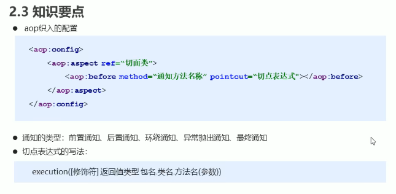

## 3.1、基于注解的AOP开发


# SpringMVC

## 1、SpringMVC简介

### 1.1、SpringMVC概述

SpringMVC是一种基于Java的实现MVC设计模型的请求驱动类型的轻量级Web框架，属于SpringFrameWork的后续产品，已经融合在Spring Web Flow中

SpringMVC已经称为目前最主流的MVC框架之一，并且随着Spring3.0的发布，全面超越Struts2，称为最优秀的MVC框架。它通过一套注解，让一个简单的Java类成为处理请求的控制器，而无需实现任何接口。同时它还支持RESTful编程风格的请求。

### 1.2、SpringMVC快速入门


需求：客户端发起请求，服务器端接受请求，执行逻辑并进行试图跳转。

开发步骤：

①导入SpringMVC相关坐标

②配置SpringMVC核心控制器DispathcerServlet

③创建Controller类和视图页面

④使用注解配置Controller类中业务方法的映射地址

⑤配置SpringMVC核心文件spring-mvc.xml

⑥客户端发起请求测试

### 1.3、SpringMVC流程图


## 2、SpringMVC组件解析

### 2.1、SpringMVC的执行流程


①用户发送请求至前端控制器DispatcherServlet。

②DispatcherServlet收到请求调用HandlerMapping处理器映射器。

③处理器映射器找到具体的处理器(可以根据xml配置、注解进行查找)，生成处理器对象处理器拦截器(如果有则生成)一并返回给DispatcherServlet

④DispatcherServlet调用HandlerAdapter处理器适配器

⑤HandlerAdapter经过适配调用具体的处理器(Controller,也叫后端控制器)。

⑥Controller执行完成返回ModelAndView。

⑦HandlerAdapter将controller执行结果ModelAndView返回给DispatcherServlet。

⑧DispatcherServlet将ModelAndView传给ViewReslover视图解析器。

⑨ViewReslover解析后返回具体View。

⑩DispatcherServlet根据View进行渲染视图(即将模型数据填充至视图中)DispatcherServlet响应用户。

### 2.2、SpringMVC注解解析

@RequestMapping

作用：请求映射，主要是用于建立请求URL和处理请求方法之间的对应关系。

位置：

- 类上：请求URL的第一级访问目录。此处不写的话，就相当于应用的根目录

- 方法上：请求URL的第二级访问目录，与类上的使用@ReqquestMapping标注的一级目录一起组成访问虚拟路径。

属性：

- value：用于指定请求的URL。它和paht属性的作用是一样的

- method：用于指定请求的方式

- params：用于指定限制请求参数的条件。它支持简单的表达式。要求请求参数的key和value必须和配置的一摸一样。

### 2.3、知识要点


## 3、SpringMVC的数据响应

### 3.1、SpringMVC的数据相应方式


- 使用map

- 使用ModelAndView

- 使用req.setAttribute


## 4、SpringMVC的请求

### 4.1、获得请求参数

格式：?name=value&name=value

服务器端要获得请求的参数，有时还需要进行数据的封装，SpringMVC可以接受如下类型的参数：

- 基本类型参数

- POJO类型参数

- 数组类型参数

- 集合类型参数

Controller中的业务方法的参数名称要与请求参数的name一致，参数值会自动映射匹配。

# MyBatis

## 1、Mybatis简介

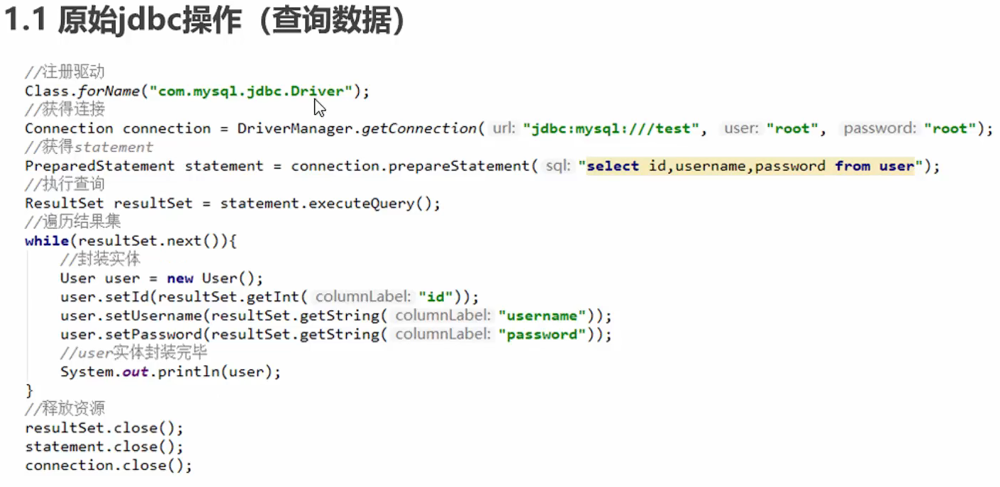


### 1.2、原始jdbc操作的分析

原始jdbc开发存在的问题如下：

①数据库连接创建、释放频繁造成系统资源浪费从而影响系统性能。

②sql语句在代码中硬编码，造成代码不宜维护，实际应用sql变化的可能比较大，sql变动需要改变java代码。

③查询操作时，需要手动将结果集中的数据手动封装到实体中。插入操作时，需要手动将实体的数据设置到sql语句的占位符位置

应对上述问题给出的解决方案：

①使用数据库连接池初始化连接资源

②将sql语句抽取到xml配置文件中

③使用反射、内省等底层技术，自动将实体与表进行属性与字段的自动映射

### 1.3、什么是Mybatis

- mybatis是一个优秀的基于java的持久层框架，它内部封装了jdbc，使开发者只需要关注sql语句本身，而不需要花费精力去处理加载驱动、创建链接、创建statement等繁杂的过程

- mybatis通过xml或注解的方式将要执行的各种statement配置起来，并通过java对象和statement中sql的动态参数进行映射生成最终执行的sql语句

- 最后mybatis框架执行sql并将结果映射为java对象并返回，采用ORM思想解决了实体和数据库映射的我呢提，对jdbc进行了封装，屏蔽了jdbc api底层访问细节，是我们不用与jdbc api打交道，就可以完成对数据库的持久化操作。

## 2、Mybatis的快速入门

MyBatis官网地址：https://mybatis.org/mybatis-3/

### 2.1、MyBatis开发步骤

①添加MyBatis的坐标

②创建user数据表

③编写User实体类

④编写映射文件UserMapper.xml

⑤编写核心文件SqlMapConfig.xml

⑥编写测试类

ps:④UserMapper.xml

```
<?xml version="1.0" encoding="UTF-8"?>
<!DOCTYPE mapper PUBLIC "-//mybatis.org//DTD Mapper 3.0//EN"
        "http://mybatis.org/dtd/mybatis-3-mapper.dtd">
<mapper namespace="userMapper">
    <select id="findAll" resultType="com.company.MyBatis_quick.Pojo.User">
        select * from user
    </select>
</mapper>
```

ps:⑤SqlMapConfig.xml

```
<?xml version="1.0" encoding="UTF-8"?>
<!DOCTYPE configuration PUBLIC "-//mybatis.org//DTD Mapper 3.0//EN"
        "http://mybatis.org/dtd/mybatis-3-config.dtd">
<configuration>
    <!--数据源环境    -->
    <environments default="development">
        <environment id="development">
            <transactionManager type="JDBC"></transactionManager>
            <dataSource type="POOLED">
                <property name="driver" value="com.mysql.cj.jdbc.Driver"/>
                <property name="url" value="jdbc:mysql://localhost:3306/test?useSSL=false&amp;useUnicode=true&amp;characterEncoding=UTF-8&amp;serverTimezone=Asia/Shanghai"/>
                <property name="username" value="root"/>
                <property name="password" value="123456"/>
            </dataSource>
        </environment>
    </environments>
    <!--加载映射文件    -->
    <mappers>
        <mapper resource="com/company/mapper/UserMapper.xml"></mapper>
    </mappers>

</configuration>
```

ps:⑥测试类

```
//获取核心配置文件
InputStream resourceAsStream = Resources.getResourceAsStream("SqlMapConfig.xml");
//获取session工厂对象
SqlSessionFactory sqlSessionFactory = new SqlSessionFactoryBuilder().build(resourceAsStream);
//获得session会话对象
SqlSession sqlSession = sqlSessionFactory.openSession();
//执行操作 参数：namespace+id
List<User> userList = sqlSession.selectList("userMapper.findAll");
//打印数据
System.out.println(userList);
//释放资源
sqlSession.close();
```

## 3、Mybatis映射文件概述

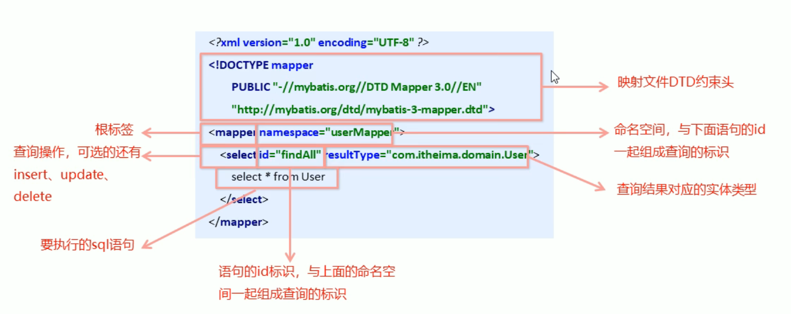

## 4、Mybatis的增删改查

### 4.1、MyBatis的插入数据操作

#### 4.1.1、插入操作需要注意的问题：

- 插入语句使用insert标签

- 在映射文件中使用parameterType属性指定要插入的数据类型

- Sql语句中使用#{实体属性名}方式引用实体中的属性值

- 插入操作使用的API是sqlSession.insert("命名空间.id"，实体对象);

- 插入操作设计数据库数据变化，需要使用sqlSession对象进行事务提交，即sqlSession.commit();

```
<!--插入操作    -->
<insert id="save" parameterType="com.company.MyBatis_quick.Pojo.User">
    insert into user (id, username, password)values(#{id},#{username},#{password})
</insert>
```

```
@Test
public void test2() throws IOException {

    User user = new User();
    user.setUsername("小羊");
    user.setPassword("123456");
    //获取核心配置文件
    InputStream resourceAsStream = Resources.getResourceAsStream("SqlMapConfig.xml");
    //获取session工厂对象
    SqlSessionFactory sqlSessionFactory = new SqlSessionFactoryBuilder().build(resourceAsStream);
    //获得session会话对象
    SqlSession sqlSession = sqlSessionFactory.openSession();
    //执行操作
    sqlSession.insert("userMapper.save",user);
    //mybatis执行更新操作需要提交事务
    sqlSession.commit();
    //释放资源
    sqlSession.close();
}
```

#### 4.1.2、修改操作需要注意的问题：

- 修改语句使用insert标签

- 在映射文件中使用parameterType属性指定要修改的数据类型

- Sql语句中使用#{实体属性名}方式引用实体中的属性值

- 修改操作使用的API是sqlSession.update("命名空间.id"，实体对象);

- 修改操作设计数据库数据变化，需要使用sqlSession对象进行事务提交，即sqlSession.commit();

```
<!--修改操作    -->
<update id="update" parameterType="com.company.MyBatis_quick.Pojo.User">
    update user set username = #{username},password = #{password} where id = #{id};
</update>
```

```
@Test
public void test3() throws IOException {

    User user = new User();
    user.setUsername("小绵羊");
    user.setPassword("123456");
    user.setId(4);
    //获取核心配置文件
    InputStream resourceAsStream = Resources.getResourceAsStream("SqlMapConfig.xml");
    //获取session工厂对象
    SqlSessionFactory sqlSessionFactory = new SqlSessionFactoryBuilder().build(resourceAsStream);
    //获得session会话对象
    SqlSession sqlSession = sqlSessionFactory.openSession();
    //执行操作
    sqlSession.update("userMapper.update",user);
    //mybatis执行更新操作需要提交事务
    sqlSession.commit();
    //释放资源
    sqlSession.close();
}
```

#### 4.1.3、删除操作需要注意的问题：

- 删除语句使用insert标签

- 在映射文件中使用parameterType属性指定要删除的数据类型

- Sql语句中使用#{实体属性名}方式引用实体中的属性值

- 删除操作使用的API是sqlSession.delete("命名空间.id"，实体对象);

- 删除操作设计数据库数据变化，需要使用sqlSession对象进行事务提交，即sqlSession.commit();

```
<!--删除操作    -->
<delete id="delete" parameterType="java.lang.Integer">
    delete from user where id=#{id};
</delete>
```

```
@Test
public void test4() throws IOException {
    int id = 5;
    //获取核心配置文件
    InputStream resourceAsStream = Resources.getResourceAsStream("SqlMapConfig.xml");
    //获取session工厂对象
    SqlSessionFactory sqlSessionFactory = new SqlSessionFactoryBuilder().build(resourceAsStream);
    //获得session会话对象
    SqlSession sqlSession = sqlSessionFactory.openSession();
    //执行操作
    sqlSession.delete("userMapper.delete",id);
    //mybatis执行删除操作需要提交事务
    sqlSession.commit();
    //释放资源
    sqlSession.close();
}
```

## 5、Mybatis核心配置文件

### 5.1、MyBatis核心配置文件层级关系

- configuration配置

- properties 属性

- settings 设置

- typeAliases 类型别名

- typeHandlers 类型处理器

- objectFactory 对象工厂

- plugins 插件

- environments 环境

- environment 环境变量

- transactionManager 事务管理器

- dataSource 数据源

- databaseIdProvider 数据库厂商便是

- mappers 映射器

### 5.2、MyBatis常用配置解析

官方文档：https://mybatis.net.cn/configuration.html

1、environments标签

数据库环境的配置，支持多环境配置


其中，事务管理器(transactionManager)类型有两种：

- JDBC：这个配置就是直接使用了JDBC的提交和回滚设置，它依赖于从数据源得到的链接来管理事务作用域

- MANAGED：这个配置几乎没做什么。他从来不提交或回滚一个连接，而是让容器来管理事务的整个生命周期(比如JEE应用服务器的上下文)。默认情况下它会关闭连接，然而一些容器并不希望这样，因此需要将closeConnection属性设置为false来阻止它默认的关闭行为。

其中，数据源(dataSource)类型有三种：

- UNPOOLED：这个数据源的实现只是每次请求打开和关闭链接

- POOLED：这种数据源的实现利用”池“的概念将JDBC连接对象组织起来。

- JNDI：这个数据源的实现是为了能在比如EJB或应用服务器这类容器中使用，容器可以其中或在外部配置数据源，然后放置一个JNDI上下文的引用。

2、mapper标签

该标签的作用是加载映射的，加载方式有如下几种：

- 使用相对于类路径的资源引用，例如：<mapper resource="org/mybatis/builder/builder/AuthorMapper.xml"/>

- 使用完全限定资源定位符(URL)，例如：<mapper url="file:///var/mappers/AuthorMapper.xml"/>

- 使用映射器接口实现类的完全限定类名，例如：<mapper class="org.mybatis.builder.AuthorMapper"/>

- 将包内的映射器接口实现全部注册为映射器，例如：<package name="org.mybatis.builder"/>


3、Properties标签

实际开发中，习惯将数据源的配置信息单独抽取成一个properties文件，该标签可以加载额外配置的properties文件。

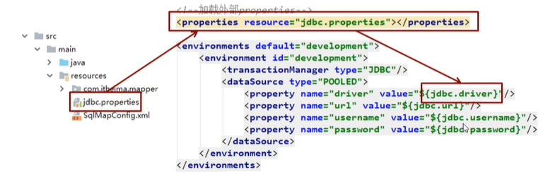

4、typeAliases标签

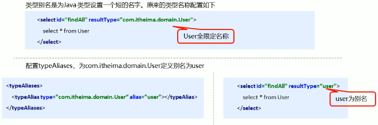

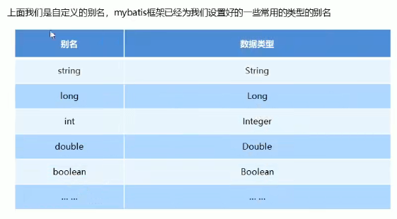

## 6、Mybatis相应API

### 6.1、SqlSession工厂构建器SqlSessionFactoryBuilder

常用API：SqlSessionFactory build(InputStream inputStream)

通过加载mybatis的核心文件的输入流的形式构建一个SqlSessionFactory对象

```
String resource = "org/mybatis/builder/mybatis-config.xml";
InputStream inputStream = Resources.getResourceAsStream(resource);
SqlSessionFactoryBuilder builder = new SqlSessionFactoryBuilder();
SqlSessionFactory factory = builder.build(inputStream)
```

其中Resources工具类，这个类在org.apache.ibatis.io包中。Resources类帮助你从类路径下、系统文件或一个web URL中加载资源文件。

### 6.2、SqlSession工厂对象SqlSessionFactory

SqlSessionFactory有多个方法创建SqlSession实力，常用的有如下两个：

```
openSession() 会默认开启一个事务，但事务不会自动提交。
openSession(boolean autoCommit)  参数为是否自动提交。
```

### 6.3、SqlSession会话对象

SqlSession实例在MyBatis中是非常强大的一个类。在这里你会看到所有执行语句、提交或回滚事务和获取映射器实例的方法。执行语句的方法主要有：

```
<T> T selectOne(String statement,Object parameter)
<E> List<E> selectList (Stringg statement,Object parameter)
int insert (String statement,Object parameter)
int update (String statement,Object parameter)
int delete (String statement,Object parameter)
```

操作事务的主要方法有：

```
void commit()
void rollback()
```

## 7、Mybatis的dao层实现

### 7.1、传统开发方式

与javaweb结构相似

### 7.2、代理开发方式

#### 7.2.1、代理开发方式介绍

采用Mybatis的代理开发方式实现DAO层的开发，这种方式是我们后面进入企业的主流。

Mapper接口开发方法只需要程序员编写Mapper接口(相当于Dao接口)，有Mybatis框架根据接口定义创建接口的动态代理对象，代理对象的方法体同上边Dao接口实现类方法。

Mapper接口开发需要遵循一下规范：

①Mapper.xml文件中的namespace与mapper接口的全限定名相同

②Mapper接口方法名和Mapper.xml中定义的每个statement的id相同

③Mapper接口方法的输入参数类型和mapper.xml中定义的每个sql的parameterType的类型相同

④Mapper接口方法的输出参数类型和mapper.xml中定义的每个sql的resultType的类型相同

#### 7.2.2、编写UserMapper接口

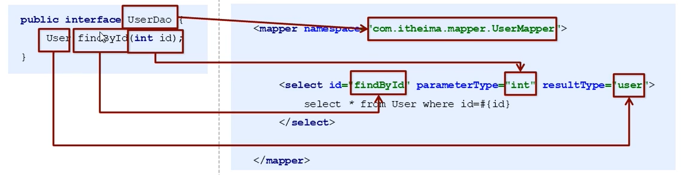

## 8、Mybatis映射文件深入

### 8.1、动态sql语句(https://mybatis.net.cn/dynamic-sql.html)

#### 8.1.1、动态sql语句

- <if>

我们根据实体类的不同取值，使用不同的SQL语句来进行查新，比如在id如果不为空时可以根据id查询，如果username不为空时还要加入用户名作为条件。这种情况在我们的多条件组合查询中经常碰到。

```
<?xml version="1.0" encoding="UTF-8"?>
<!DOCTYPE mapper PUBLIC "-//mybatis.org//DTD Mapper 3.0//EN"
        "http://mybatis.org/dtd/mybatis-3-mapper.dtd">
<mapper namespace="com.company.MyBatis_Dao.Dao.UserMapper">
    <!--根据Condition查询操作    -->
    <select id="findByCondition" parameterType="User" resultType="User">
        select * from user
        <where>
            <if test="id!=0">
                and id=#{id}
            </if>
            <if test="username!=null">
                and username=#{username}
            </if>
            <if test="password!=null">
                and password=#{password}
            </if>
        </where>
    </select>
</mapper>
```

- <foreach>

循环执行sql的拼接操作，例如：select * from user where id in（1，2，5）

```
<?xml version="1.0" encoding="UTF-8"?>
<!DOCTYPE mapper PUBLIC "-//mybatis.org//DTD Mapper 3.0//EN"
        "http://mybatis.org/dtd/mybatis-3-mapper.dtd">
<mapper namespace="com.company.MyBatis_Dao.Dao.UserMapper">
    <select id="findByIds" parameterType="list" resultType="User">
        select * from user
        <where>
            <foreach collection="list" open="id in(" close=")" item="id" separator=",">
                #{id}
            </foreach>
        </where>
    </select>
</mapper>
```

### 8.2、sql片段的抽取

```
<?xml version="1.0" encoding="UTF-8"?>
<!DOCTYPE mapper PUBLIC "-//mybatis.org//DTD Mapper 3.0//EN"
        "http://mybatis.org/dtd/mybatis-3-mapper.dtd">
<mapper namespace="com.company.MyBatis_Dao.Dao.UserMapper">

    <!--sql语句抽取    -->
    <sql id="selectUser">select * from user</sql>
    <!--根据Condition查询操作    -->
    <select id="findByCondition" parameterType="User" resultType="User">
        <include refid="selectUser"></include>
        <where>
            <if test="id!=0">
                and id=#{id}
            </if>
            <if test="username!=null">
                and username=#{username}
            </if>
            <if test="password!=null">
                and password=#{password}
            </if>
        </where>
    </select>

    <select id="findByIds" parameterType="list" resultType="User">
        <include refid="selectUser"></include>
        <where>
            <foreach collection="list" open="id in(" close=")" item="id" separator=",">
                #{id}
            </foreach>
        </where>
    </select>
</mapper>
```

## 9、Mybatis核心配置文件深入

### 9.1、typeHandlers标签

无论是MyBatis在处理语句(PreparedStatement)中设置一个参数时，还是从结果集中取出一个值时，都会用类型处理器将获取的值以合适的方式转换成Java类型。下标描述了一些默认的类型处理器(部分)

| 类处理器 | Java类型 | JDBC类型 |
| - | - | - |
| BooleanTypeHandler | java.lang.Boolean,boolean | 数据库兼容的BOOLEAN |
| ByteTypeHandler | java.lang.Byte,byte | 数据库兼容的NUMERIC或BYTE |
| ShortTypeHandler | java.lang.Short,short | 数据库兼容的NUMERIC或SHORT INTEGER |
| IntegerTypeHandler | java.lang.Integer,int | 数据库兼容的NUMERIC或INTEGER |
| LongTypeHnadler | java.lang.long,long | 数据库兼容的NUMERIC或LONG INTEGER |


你可以重写类型处理器或创建自己的类型处理器来处理不持支的或非标准的类型。具体做法为：实现org.apache.ibatis.type.TybeHandler接口，或继承一个很便利的类org.apache.ibatis.type.BaseTypeHandler,然后可以选择性地将它映射到一个JDBC类型。例如需求：一个Java中的Date数据类型，我想将之存入到数据库的时候存成一个1790至今的毫秒数，取出来时转换成java的Date，即java的Date与数据库的varchar毫秒之间转换。

开发步骤：

①定义转换继承类BaseTypeHandler<T>

②覆盖4个为实现的方法，其中setNonNullParameter为java程序设置数据到数据库的回调方法，getNullableResult为查询时mysql的字符串类型转换成java的Type类型的方法

③在MyBatis核心配置文件中进行注册

④测试转换是否正确

```
package com.company.MyBatis_Dao.Handler;

import org.apache.ibatis.type.BaseTypeHandler;
import org.apache.ibatis.type.JdbcType;

import java.sql.CallableStatement;
import java.sql.PreparedStatement;
import java.sql.ResultSet;
import java.sql.SQLException;
import java.util.Date;

public class DateTypeHandler extends BaseTypeHandler<Date> {

    @Override
    public void setNonNullParameter(PreparedStatement preparedStatement, int i, Date date, JdbcType jdbcType) throws SQLException {
        long time = date.getTime();
        preparedStatement.setLong(i,time);
    }

    @Override
    public Date getNullableResult(ResultSet resultSet, String s) throws SQLException {
        long aLong = resultSet.getLong(s);
        Date date = new Date(aLong);
        return date;
    }

    @Override
    public Date getNullableResult(ResultSet resultSet, int i) throws SQLException {
        long aLong = resultSet.getLong(i);
        Date date = new Date(aLong);
        return date;
    }

    @Override
    public Date getNullableResult(CallableStatement callableStatement, int i) throws SQLException {
        long aLong = callableStatement.getLong(i);
        Date date = new Date(aLong);
        return date;
    }
}

```

```
<!--注册类型处理器    -->
<typeHandlers>
    <typeHandler handler="com.company.MyBatis_Dao.Handler.DateTypeHandler"></typeHandler>
</typeHandlers>
```

### 9.2、plugins标签

MyBatis可以使用第三方的插件来对功能进行扩展，分页助手PageHelper是将分页的复杂操作进行封装，使用简单的方式即可获得分页的相关数据

开发步骤：

①导入通用PageHelper的坐标

```
<dependency>
    <groupId>com.github.pagehelper</groupId>
    <artifactId>pagehelper</artifactId>
    <version>3.7.5</version>
</dependency>
<dependency>
    <groupId>com.github.jsqlparser</groupId>
    <artifactId>jsqlparser</artifactId>
    <version>0.9.1</version>
</dependency>
```

②在mybatis核心配置文件中配置PageHelper插件

```
<!--配置分页助手插件    -->
<plugins>
    <plugin interceptor="com.github.pagehelper.PageHelper">
        <property name="dialect" value="mysql"/>
    </plugin>
</plugins>
```

③测试分页数据获取

## 10、Mybatis的多表操作

### 10.1、一对一的封装查询<resultMap>(<association>)

- Order

```
package com.company.MyBatis_multi.Pojo;

import java.sql.Timestamp;

public class Order {

  private long id;
  private java.sql.Timestamp ordertime;
  private Double total;

  //表示当前订单属于哪一个用户
  private User user;
}

```

- User

```
package com.company.MyBatis_multi.Pojo;

import java.util.Date;

public class User {
    private int id;
    private String username;
    private String password;
    private Date Birthday;
}

```

- OrderMapper.xml

```
<?xml version="1.0" encoding="UTF-8"?>
<!DOCTYPE mapper PUBLIC "-//mybatis.org//DTD Mapper 3.0//EN"
        "http://mybatis.org/dtd/mybatis-3-mapper.dtd">
<mapper namespace="com.company.MyBatis_multi.Dao.OrderMapper">
    <resultMap id="orderMap" type="Order">
        <!--手动指定字段与实体属性的映射关系(column：数据库的字段名称 property：实体的属性名称)-->
        <id column="oid" property="id"></id>
        <result column="ordertime" property="ordertime"></result>
        <result column="total" property="total"></result>
        <result column="uid" property="user.id"></result>
        <result column="username" property="user.username"></result>
        <result column="password" property="user.password"></result>
        <result column="birthday" property="user.birthday"></result>
    </resultMap>
    <select id="selectOrders" resultMap="orderMap">
        select *,o.id oid from `order` o,`user` u where o.uid=u.id
    </select>

</mapper>
```

- <association>标签

```
<?xml version="1.0" encoding="UTF-8"?>
<!DOCTYPE mapper PUBLIC "-//mybatis.org//DTD Mapper 3.0//EN"
        "http://mybatis.org/dtd/mybatis-3-mapper.dtd">
<mapper namespace="com.company.MyBatis_multi.Dao.OrderMapper">
    <resultMap id="orderMap" type="Order">
        <!--手动指定字段与实体属性的映射关系(column：数据库的字段名称 property：实体的属性名称)-->
        <id column="oid" property="id"></id>
        <result column="ordertime" property="ordertime"></result>
        <result column="total" property="total"></result>
        <association property="user" javaType="User">
            <id column="uid" property="id"></id>
            <result column="username" property="username"></result>
            <result column="password" property="password"></result>
            <result column="Birthday" property="Birthday"></result>
        </association>
    </resultMap>
    <select id="selectOrders" resultMap="orderMap">
        select *,o.id oid from `order` o,`user` u where o.uid=u.id
    </select>

</mapper>
```

### 10.2、一对多或多对一的封装查询<resultMap>+<collection>

- <collection>标签

```
<?xml version="1.0" encoding="UTF-8"?>
<!DOCTYPE mapper PUBLIC "-//mybatis.org//DTD Mapper 3.0//EN"
        "http://mybatis.org/dtd/mybatis-3-mapper.dtd">
<mapper namespace="com.company.MyBatis_multi.Dao.UserMapper">

    <resultMap id="userMap" type="user">
        <id column="uid" property="id"></id>
        <result column="username" property="username"></result>
        <result column="password" property="password"></result>
        <result column="birthday" property="birthday"></result>
        <!--property:集合名称-->
        <collection property="orderList" ofType="Order">
            <id column="oid" property="id"></id>
            <result column="ordertime" property="ordertime"></result>
            <result column="total" property="total"></result>
        </collection>
    </resultMap>

    <select id="findAll" resultMap="userMap">
        select *,o.id oid from `user` u,`order` o where u.id=o.uid
    </select>

</mapper>
```

- User

```
package com.company.MyBatis_multi.Pojo;

import java.util.Date;
import java.util.List;

public class User {

    private int id;
    private String username;
    private String password;
    private Date Birthday;

    private List<Order> orderList;
    
}

```

### 10.3、多对多的封装查询<resultMap>+<collection>


和一对多相似


## 11、Mybatis的注解开发

### 11.1、MyBatis的常用注解

这几年来注解开发越来越流行，Mybatis也可以使用注解开发方式，这样我们就可以减少编写Mapper映射文件了。我们先围绕一些基本的CRUD来学习，再学习复杂映射多表操作。

@Insert：实现新增

@Update：实现更新

@Delete：实现删除

@Select：实现查询

@Result：实现结果集封装

@Results：可以与@Result一起使用，封装多个结果集

@One：实现一对一结果集封装

@Many：实现一对多结果集封装

```
@Results(id="groupWithUsers",
         value = { 
            @Result(property = "groupId", column = "group_id", id = true),
            @Result(property = "name", column = "name"), 
            @Result(property = "accountId", column = "account_id"),
            @Result(property = "deleteFlag", column = "delete_Flag"),
            @Result(property = "parentId", column = "parent_Id"), 
            @Result(property = "userList", javaType=List.class, many =@Many(select="selectUsersByGroupId"), column = "group_id")})
//查询
@Select({"select * from group where account_id=#{accountId} and delete_flag=0"})
List<Group> selectGroupWithUsers(@Param("accountId") String accountId);
 
 
@Select({"select u.* from user u",
		"inner join user_group ug on u.user_id = ug.user_id",
		"where ug.group_id=#{groupId} and u.delete_flag=0"
		})
List<User> selectUsersByGroupId(@Param("groupId") String groupId);

```

# Spring与Mybatis的整合


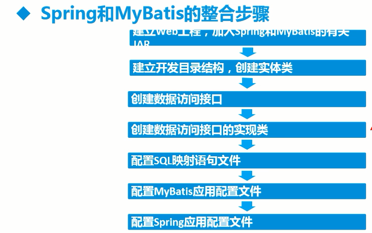


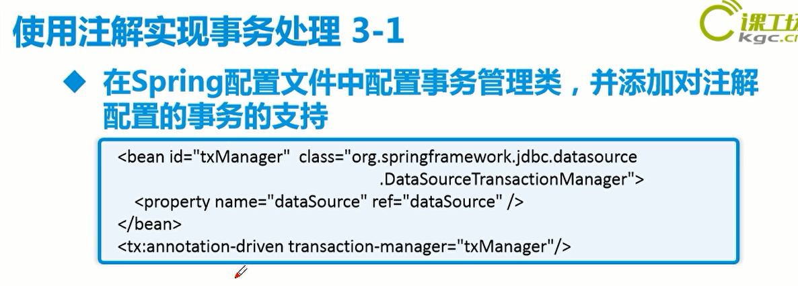


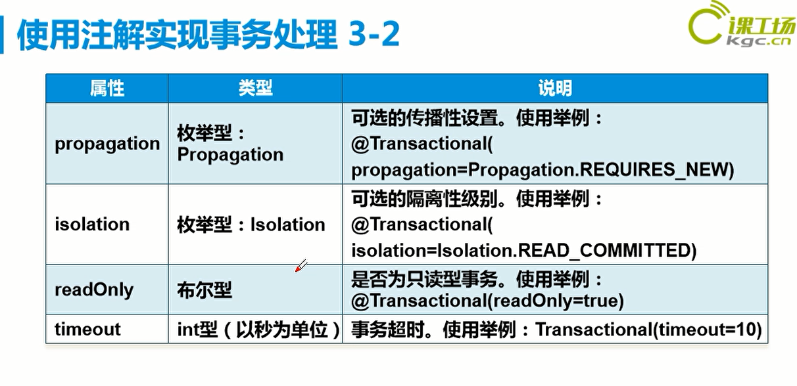


applicationContext.xml

```
<?xml version="1.0" encoding="UTF-8"?>
<beans xmlns="http://www.springframework.org/schema/beans"
       xmlns:xsi="http://www.w3.org/2001/XMLSchema-instance"
       xmlns:aop="http://www.springframework.org/schema/aop"
       xmlns:context="http://www.springframework.org/schema/context"
       xmlns:tx="http://www.springframework.org/schema/tx"
       xmlns:p="http://www.springframework.org/schema/p"
       xsi:schemaLocation="http://www.springframework.org/schema/beans
       http://www.springframework.org/schema/beans/spring-beans.xsd
       http://www.springframework.org/schema/context
      http://www.springframework.org/schema/context/spring-context.xsd
       http://www.springframework.org/schema/aop
      http://www.springframework.org/schema/aop/spring-aop.xsd
       http://www.springframework.org/schema/tx
      http://www.springframework.org/schema/tx/spring-tx.xsd">


    <context:component-scan base-package="com.company.MS1"/>
    <aop:aspectj-autoproxy/>
    <tx:annotation-driven transaction-manager="txManager"/>

    <bean id="dataSource" class="org.apache.commons.dbcp.BasicDataSource">
        <property name="driverClassName" value="com.mysql.cj.jdbc.Driver"></property>
        <property name="url" value="jdbc:mysql://localhost:3306/test?useSSL=false&amp;useUnicode=true&amp;characterEncoding=utf-8&amp;serverTimezone=Asia/Shanghai"></property>
        <property name="username" value="root"></property>
        <property name="password" value="123456"></property>
    </bean>

    <bean id="sqlSessionFactory" class="org.mybatis.spring.SqlSessionFactoryBean">
        <property name="configLocation" value="Mybatis_config.xml"></property>
        <property name="dataSource" ref="dataSource"></property>
        <property name="mapperLocations">
            <array>
                <value>com.company.mapper/ProviderMapper.xml</value>
            </array>
        </property>
    </bean>
<!-- SqlSessionTemplate-->
<!--    <bean id="sqlSessionTemplate" class="org.mybatis.spring.SqlSessionTemplate">-->
<!--        <constructor-arg name="sqlSessionFactory" ref="sqlSessionFactory"/>-->
<!--    </bean>-->

<!--    <bean id="providerMapper" class="com.company.MS1.Mapper.Impl.ProviderMapperImpl">-->
<!--        <property name="sqlSessionTemplate" ref="sqlSessionTemplate"></property>-->
<!--    </bean>    -->

<!-- MapperFactoryBean-->
<!--    <bean id="providerMapper" class="org.mybatis.spring.mapper.MapperFactoryBean">-->
<!--        <property name="mapperInterface" value="com.company.MS1.Mapper.ProviderMapper"></property>-->
<!--        <property name="sqlSessionFactory" ref="sqlSessionFactory"></property>-->
<!--    </bean>-->

<!--    <bean id="providerService" class="com.company.MS1.Service.Impl.ProviderServiceImpl">-->
<!--        <property name="providerMapper" ref="providerMapper"></property>-->
<!--    </bean>    -->

<!--    <bean id="providerService" class="com.company.MS1.Service.Impl.ProviderServiceImpl">-->
<!--        <property name="providerMapper" ref="providerMapper"></property>-->
<!--    </bean>-->

<!-- MapperScannerConfigurer-->
    <bean class="org.mybatis.spring.mapper.MapperScannerConfigurer">
        <property name="basePackage" value="com.company.MS1.Mapper"></property>
        <property name="sqlSessionFactoryBeanName" value="sqlSessionFactory"></property>
    </bean>

    <bean id="txManager" class="org.springframework.jdbc.datasource.DataSourceTransactionManager">
        <property name="dataSource" ref="dataSource"></property>
    </bean>
    
    <!--事务处理的配置-->
<!--    <tx:advice id="transactionInterceptor" transaction-manager="txManager">-->
<!--        <tx:attributes>-->
<!--            <tx:method name="select*" propagation="REQUIRED"/>-->
<!--            <tx:method name="*" propagation="REQUIRED"/>-->
<!--        </tx:attributes>-->
<!--    </tx:advice>-->
<!--    -->
<!--    <aop:config>-->
<!--        <aop:pointcut id="pointcut" expression="execution(* com.company.MS1..*.*(..))"/>-->
<!--        <aop:advisor advice-ref="transactionInterceptor" pointcut-ref="pointcut"></aop:advisor>-->
<!--    </aop:config>-->

</beans>
```

