# 微服务框架（三）

## 一、**RabbitMQ**

### **同步通讯**


优点：

- 时效性较强，可以立即得到结果

缺点：

- 耦合度高：每次加入新的需求，都要修改原来的代码
- 性能下降：调用者需要等待服务提供者响应，如果调用链过长则响应时间等于每次调用的时间之和。
- 资源浪费：调用链中的每个服务在等待响应过程中，不能释放请求占用的资源，高并发场景下会极度浪费系统资源
- 级联失败：如果服务提供者出现问题，所有调用方都会跟着出问题，如同多米诺骨牌一样，迅速导致整个微服务群故障

### **异步通讯**

异步调用常见实现就是事件驱动模式

异步通信的优点：

- 耦合度低
- 吞吐量提升
- 故障隔离
- 流量削峰

异步通信的缺点：

- 依赖于Broker的可靠性、安全性、吞吐能力
- 架构复杂了，业务没有明显的流程线，不好追踪管理

### **什么是MQ**

MQ（MessageQueue），消息队列，字面来看就是存放消息的队列。也就是事件驱动架构中的Broker

**MQ常见框架**

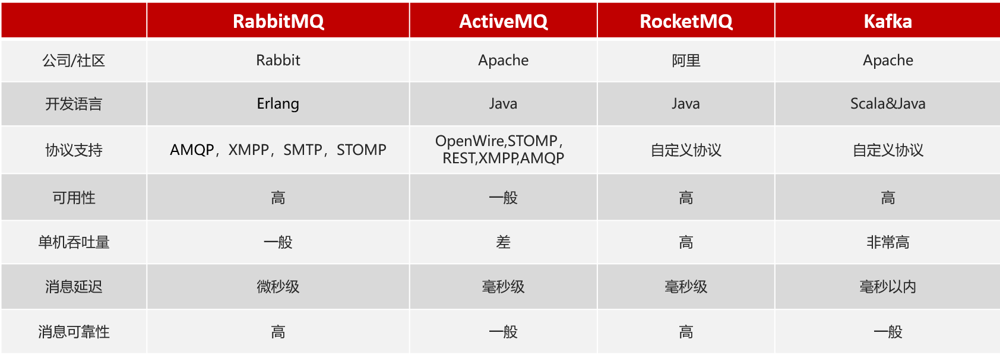

### **RabbitMQ概述和安装**

**RabbitMQ的结构和概念**


**总结**

RabbitMQ中的几个概念：

- channel：操作MQ的工具
- exchange：路由消息到队列中
- queue：缓存消息
- virtual host：虚拟主机，是对queue、exchange等资源的逻辑分组

**五种常见的消息模型**


官方的BasicQueue是基于最基础的消息队列模型来实现的，只包括三个角色：

- publisher：消息发布这，将消息发送到队列queue
- queue：消息队列，负责接受并缓存消息
- consumer：订阅队列，处理队列中的消息


实现步骤：

- 导入课前资料中的demo工程
- 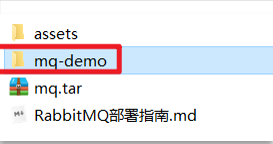
- 运行publisher服务中的测试类PublisherTest中的测试方法testSendMessage()
- 查看RabbitMQ控制台的消息
- 启动consumer服务，查看是否能接收消息

### **总结**

基本消息队列的消息发送流程：

1.建立connection

2.创建channel

3.利用channel声明队列

4.利用channel向队列发送消息

基本消息队列的消息接收流程：

1.建立connection

2.创建channel

3.利用channel声明队列

4.定义consumer的消费行为handleDelivery()

5.利用channel将消费者与队列绑定

## 二、SpringAMQP

### **什么是SpringAMQP**

SpringAmqp的官方地址：https://spring.io/projects/spring-amqp

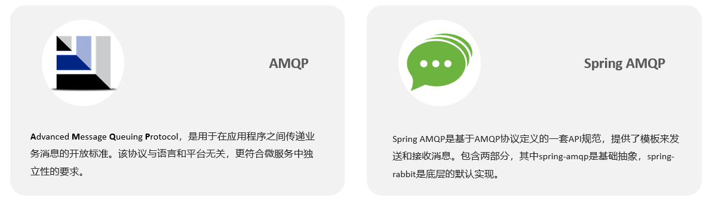

#### 总结

什么是AMQP？

- 应用间消息通信的一种协议，与语言和平台无关。

SpringAMQP如何发送消息？

- 引入amqp的starter依赖
- 配置RabbitMQ地址
- 利用RabbitTemplate的convertAndSend方法


### 1、Basic Queue简单队列模型

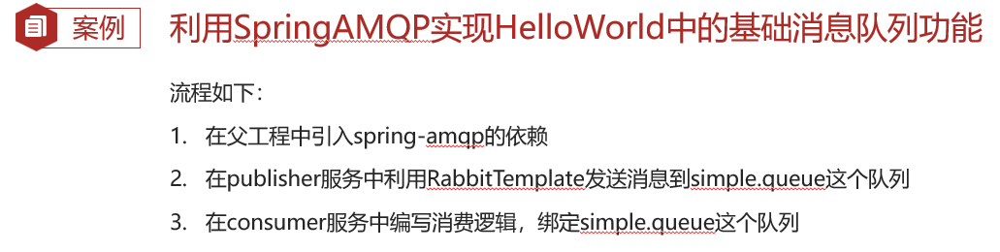


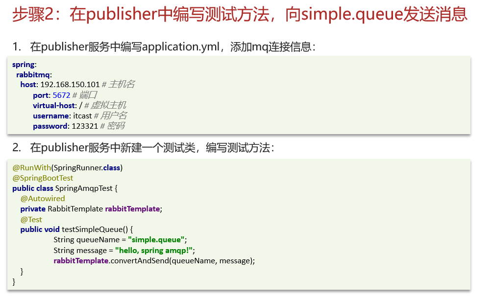

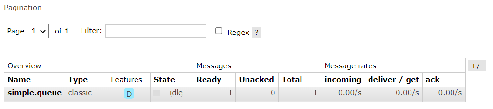


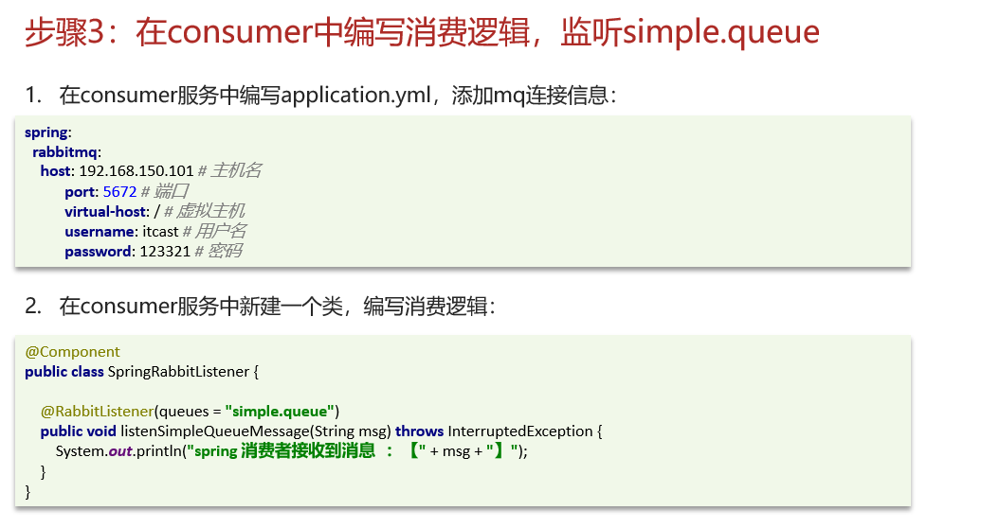

#### 总结

SpringAMQP如何接收消息？

- 引入amqp的starter依赖
- 配置RabbitMQ地址
- 定义类，添加@Component注解
- 类中声明方法，添加@RabbitListener注解，方法参数就时消息

注意：消息一旦消费就会从队列删除，RabbitMQ没有消息回溯功能

### 2、Work Queue工作队列模型

Work queue，工作队列，可以提高消息处理速度，避免队列消息堆积


观测结果为：

```
消费者1接收到消息：【hello,message__!0】10:38:08.378
消费者2........接收到消息：【hello,message__!1】10:38:08.402
消费者1接收到消息：【hello,message__!2】10:38:08.433
消费者1接收到消息：【hello,message__!4】10:38:08.496
消费者1接收到消息：【hello,message__!6】10:38:08.559
消费者2........接收到消息：【hello,message__!3】10:38:08.617
消费者1接收到消息：【hello,message__!8】10:38:08.620
消费者1接收到消息：【hello,message__!10】10:38:08.681
消费者1接收到消息：【hello,message__!12】10:38:08.744
消费者1接收到消息：【hello,message__!14】10:38:08.807
消费者2........接收到消息：【hello,message__!5】10:38:08.821
消费者1接收到消息：【hello,message__!16】10:38:08.868
消费者1接收到消息：【hello,message__!18】10:38:08.930
消费者1接收到消息：【hello,message__!20】10:38:08.994
消费者2........接收到消息：【hello,message__!7】10:38:09.024
消费者1接收到消息：【hello,message__!22】10:38:09.056
消费者1接收到消息：【hello,message__!24】10:38:09.118
消费者1接收到消息：【hello,message__!26】10:38:09.180
消费者2........接收到消息：【hello,message__!9】10:38:09.226
消费者1接收到消息：【hello,message__!28】10:38:09.243
消费者1接收到消息：【hello,message__!30】10:38:09.306
消费者1接收到消息：【hello,message__!32】10:38:09.368
消费者2........接收到消息：【hello,message__!11】10:38:09.429
消费者1接收到消息：【hello,message__!34】10:38:09.430
消费者1接收到消息：【hello,message__!36】10:38:09.496
消费者1接收到消息：【hello,message__!38】10:38:09.557
消费者1接收到消息：【hello,message__!40】10:38:09.619
消费者2........接收到消息：【hello,message__!13】10:38:09.634
消费者1接收到消息：【hello,message__!42】10:38:09.682
消费者1接收到消息：【hello,message__!44】10:38:09.745
消费者1接收到消息：【hello,message__!46】10:38:09.807
消费者2........接收到消息：【hello,message__!15】10:38:09.836
消费者1接收到消息：【hello,message__!48】10:38:09.870
消费者2........接收到消息：【hello,message__!17】10:38:10.037
消费者2........接收到消息：【hello,message__!19】10:38:10.244
消费者2........接收到消息：【hello,message__!21】10:38:10.451
消费者2........接收到消息：【hello,message__!23】10:38:10.657
消费者2........接收到消息：【hello,message__!25】10:38:10.865
消费者2........接收到消息：【hello,message__!27】10:38:11.069
消费者2........接收到消息：【hello,message__!29】10:38:11.270
消费者2........接收到消息：【hello,message__!31】10:38:11.475
消费者2........接收到消息：【hello,message__!33】10:38:11.681
消费者2........接收到消息：【hello,message__!35】10:38:11.885
消费者2........接收到消息：【hello,message__!37】10:38:12.091
消费者2........接收到消息：【hello,message__!39】10:38:12.296
消费者2........接收到消息：【hello,message__!41】10:38:12.501
消费者2........接收到消息：【hello,message__!43】10:38:12.704
消费者2........接收到消息：【hello,message__!45】10:38:12.909
消费者2........接收到消息：【hello,message__!47】10:38:13.115
消费者2........接收到消息：【hello,message__!49】10:38:13.318

```

#### 消费预取限制

修改application.yml文件，设置preFetch这个值，可以控制预取消息的上限：

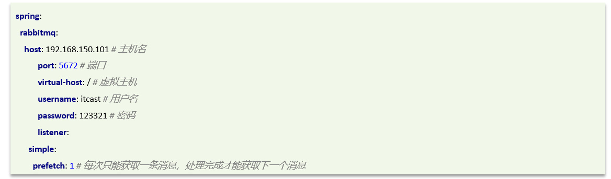

#### 总结

Work模型的使用：

- 多个消费者绑定到一个队列，同一条消息只会被一个消费者处理

- 通过设置prefetch来控制消费者预取的消息数量

### 发布（Publish）、订阅（Subscribe）

发布订阅模式与之前案例的区别就是允许将同一消息发送给多个消费者。实现方式是加入了exchange（交换机）。

常见exchange类型包括：

- Fanout：广播
- Direct：路由
- Topic：话题


**注意**：exchange负责消息路由，而不是存储，路由失败则消息丢失

### 3、发布、订阅模型-Fanout

**Fanout Exchange** 会将接收到的消息广播到**每一个**跟其绑定的queue****

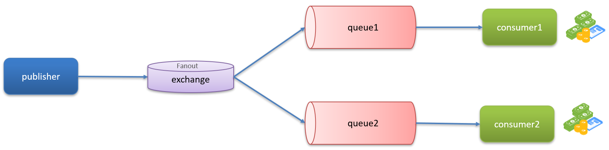

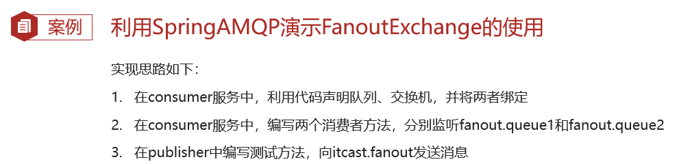


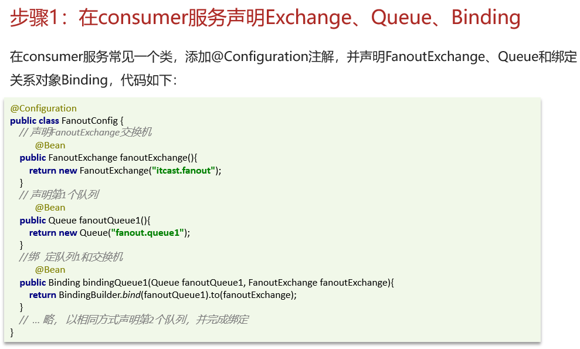


#### 总结

交换机的作用是什么？

- 接收publisher发送的消息
- 将消息按照规则路由到与之绑定的队列
- 交换机不能缓存消息，如果路由失败，消息将会丢失
- FanoutExchange会将消息路由到每个绑定的队列

声明队列、交换机、绑定关系的Bean是什么？

- Queue
- FanoutExchange
- Binding

### 4、发布、订阅模型-Direct

**Direct Exchange** 会将接收到的消息根据规则路由到**指定的Queue**，因此称为路由模式（routes）。

- 每一个Queue都与Exchange设置一个BindingKey
- 发布者发送消息时，指定消息的RoutingKey
- Exchange将消息路由到BindingKey与消息RoutingKey一致的队列

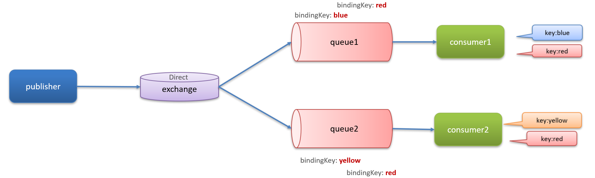


#### 总结

描述下Direct交换机与Fanout交换机的差异？

- Fanout交换机将消息路由给每一个与之绑定的队列
- Direct交换机根据RoutingKey判断路由给哪个队列
- 如果多个队列具有相同的RoutingKey，则与Fanout功能类似

基于@RabbitListener注解声明队列和交换机有哪些常见注解？

- @Queue
- @Exchange

### 5、发布、订阅模型-Topic

**TopicExchange**与**DirectExchange**类似，区别在于**routingKey**必须是多个单词的列表，并且以 **.** 分割。

Queue与Exchange指定BindingKey时可以使用通配符：

\#：代指0个或多个单词

*：代指一个单词

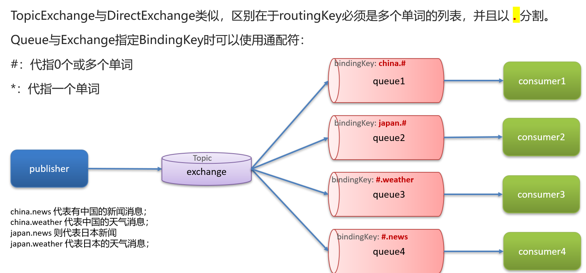

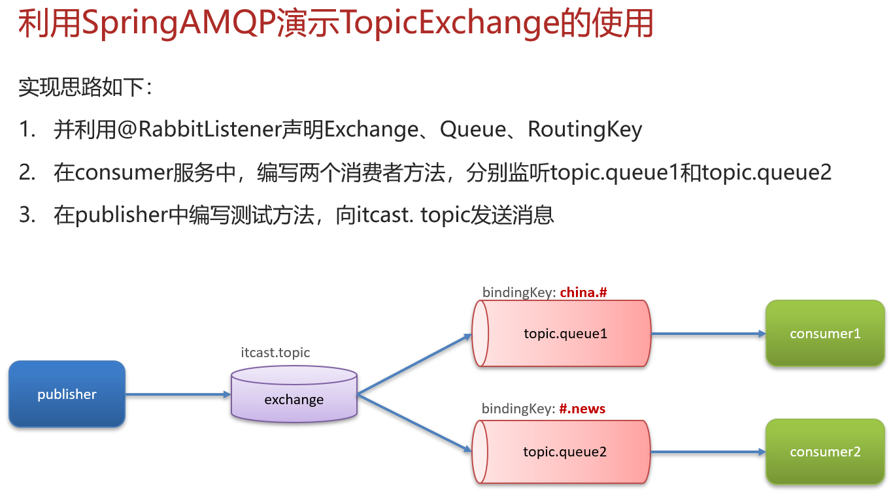


#### 总结

描述下Direct交换机与Topic交换机的差异？

•Topic交换机接收的消息RoutingKey必须是多个单词，以 **.** 分割

•Topic交换机与队列绑定时的bindingKey可以指定通配符

•#：代表0个或多个词

•*：代表1个词

### 消息转换器


#### 总结

SpringAMQP中消息的序列化和反序列化是怎么实现的？

- 利用MessageConverter实现的，默认是JDK的序列化
- 注意发送方与接收方必须使用相同的MessageConverter

## 三、分布式搜索-elasticsearch

1、初识elasticsearch

2、索引库操作

3、文档操作

4、RestAPI

# **RestClient**

# **DSL查询语法**
