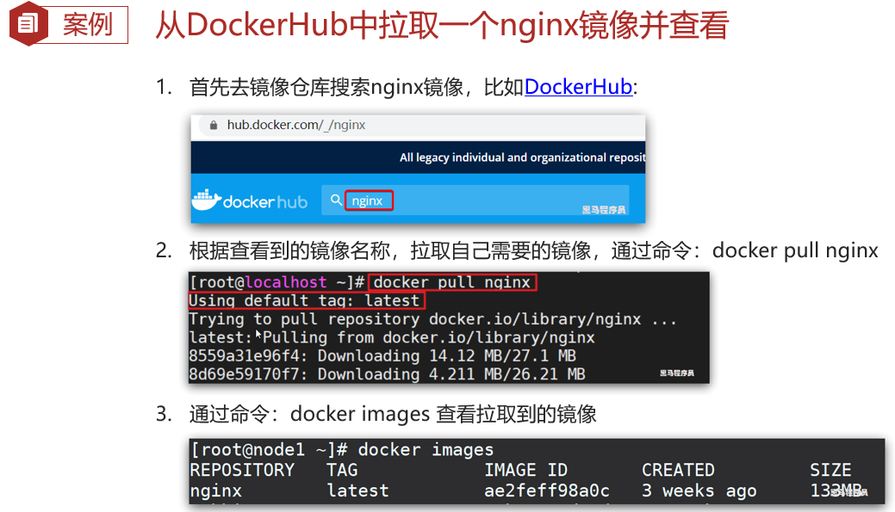
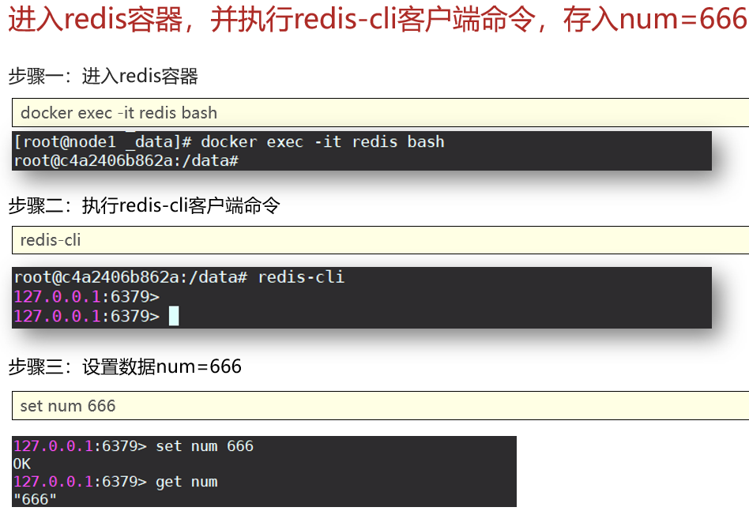
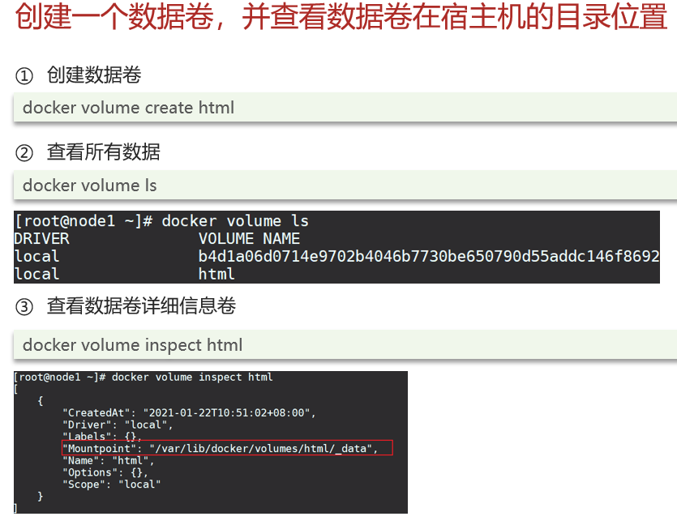
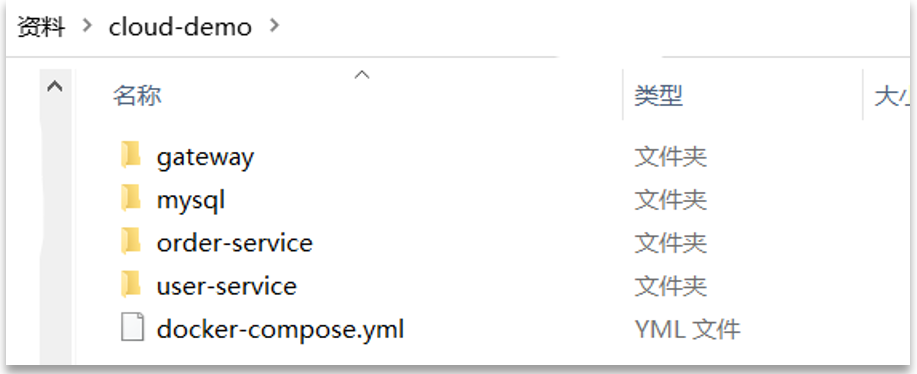

# **Docker**

## **Docker**

项目部署问题

Docker如何解决大型项目依赖关系复杂，不同组件依赖的兼容性问题？

- Docker允许开发中将应用、依赖、函数库、配置一起**打包**，形成可移植镜像
- Docker应用运行在容器中，使用沙箱机制，相互**隔离**

Docker如何解决开发、测试、生产环境有差异的问题

- Docker镜像中包含完整运行环境，包括系统函数库，仅依赖系统的Linux内核，因此可以在任意Linux操作系统上运行

| ZooKeeper     | Dubbo             | ActiveMQ   | Redis        | MySQL |
| ------------- | ----------------- | ---------- | ------------ | ----- |
| **Portainer** | **ElasticSearch** | **Kibana** | **Logstash** |       |


### **总结**

Docker是一个快速交付应用、运行应用的技术：

1.可以将程序及其依赖、运行环境一起打包为一个镜像，可以迁移到任意Linux操作系统

2.运行时利用沙箱机制形成隔离容器，各个应用互不干扰

3.启动、移除都可以通过一行命令完成，方便快捷

## **Docker与虚拟机**

虚拟机（virtual machine）是在操作系统中模拟硬件设备，然后运行另一个操作系统，比如在 Windows系统里面运行 Ubuntu 系统，这样就可以运行任意的Ubuntu应用了。

### **总结**

Docker和虚拟机的差异：

•docker是一个系统进程；虚拟机是在操作系统中的操作系统

•docker体积小、启动速度快、性能好；虚拟机体积大、启动速度慢、性能一般

## **Docker架构**

### **容器和镜像**

**镜像（Image）**：Docker将应用程序及其所需的依赖、函数库、环境、配置等文件打包在一起，称为镜像。

**容器（Container）**：镜像中的应用程序运行后形成的进程就是**容器**，只是Docker会给容器做隔离，对外不可见。

### **Docker和DockerHub**

DockerHub：[DockerHub](https://hub.docker.com/)是一个Docker镜像的托管平台。这样的平台称为Docker Registry。国内也有类似于DockerHub的公开服务，比如[网易云镜像服务](https://c.163yun.com/hub)、[阿里云镜像库](https://cr.console.aliyun.com/)等。

### **docker架构**

Docker是一个CS架构的程序，由两部分组成：

- 服务端(server)：Docker守护进程，负责处理Docker指令，管理镜像、容器等
- 客户端(client)：通过命令或RestAPI向Docker服务端发送指令。可以在本地或远程向服务端发送指令


### **总结**

镜像：

- 将应用程序及其依赖、环境、配置打包在一起

容器：

- 镜像运行起来就是容器，一个镜像可以运行多个容器

Docker结构：

- 服务端：接收命令或远程请求，操作镜像或容器
- 客户端：发送命令或者请求到Docker服务端

DockerHub：

- 一个镜像托管的服务器，类似的还有阿里云镜像服务，统称为DockerRegistry

## **安装Docker**（参考centos7安装docker）

## **Docker基本操作**

### **镜像操作**

- 镜像名称一般分两部分组成：[repository]:[tag]。
- 在没有指定tag时，默认是latest，代表最新版本的镜像

例如：mysql:5.7


docker --help、docker images --help查看帮助文档



利用dockersave将nginx镜像导出磁盘，然后再通过load加载回来：

步骤一：利用docker xx --help命令查看docker save和docker load的语法

步骤二：使用docker save导出镜像到磁盘 

步骤三：使用docker load加载镜像

#### **总结**

镜像操作有哪些？

- docker images
- docker rmi
- docker pull
- docker push
- docker save 
- docker load

### **容器操作**


#### **总结**

dockerrun命令的常见参数有哪些？

- --name：指定容器名称
- -p：指定端口映射
- -d：让容器后台运行

查看容器日志的命令：

- docker logs
- 添加 -f

参数可以持续查看日志

查看容器状态：

- docker ps


#### **总结**

查看容器状态：

- docker ps
- 添加-a参数查看所有状态的容器

删除容器：

- docker rm
- 不能删除运行中的容器，除非添加 -f 参数

进入容器：

- 命令是docker exec -it [容器名] [要执行的命令]
- exec命令可以进入容器修改文件，但是在容器内修改文件是不推荐的




### **数据卷（容器数据管理）**

容器与数据耦合存在的问题

- 不便于修改：当我们要修改Nginx的html内容时，需要进入容器内部修改，很不方便。
- 数据不可服用：在容器内的修改对外是不可见的。所有修改对新创建的容器是不可复用的。
- 升级维护困难：数据在容器内，如果要升级容器必然删除就容器，所有数据都跟着删除了。

数据卷（volume）是一个虚拟目录，指向宿主机文件系统中的某个目录。


#### **数据卷操作的基本语法如下：**

- docker volume [COMMAND]

docker volume命令是数据卷操作，根据命令后跟随的command来确定下一步的操作：

- create 创建一个volume
- inspect 显示一个或多个volume的信息
- ls 列出所有的volume
- prune 删除未使用的volume
- rm 删除一个或多个指定的volume



#### **总结**

数据卷的作用：

- 将容器与数据分离，解耦合，方便操作容器内数据，保证数据安全

数据卷操作：

- docker volume create
- docker volume ls
- docker volume inspect
- docker volume rm
- docker volume prune

#### **挂载数据卷**

我们在创建容器时，可以通过-v参数来挂在一个数据卷到某个容器目录


#### **总结**

数据卷挂载方式：

- -v volumeName: /targetContainerPath
- 如果容器运行时volume不存在，会自动被创建出来

案例：创建并运行一个MySQL容器，将宿主机目录直接挂载到容器

提示：目录挂载与数据卷挂载的语法是类似的：

- -v [宿主机目录]:[容器内目录]
- -v [宿主机文件]:[容器内文件]

实现思路如下：

1.在将课前资料中的mysql.tar文件上传到虚拟机，通过load命令加载为镜像

2.创建目录/tmp/mysql/data

3.创建目录/tmp/mysql/conf，将课前资料提供的hmy.cnf文件上传到/tmp/mysql/conf

4.去DockerHub查阅资料，创建并运行MySQL容器，要求：

①挂载/tmp/mysql/data到mysql容器内数据存储目录

②挂载/tmp/mysql/conf/hmy.cnf到mysql容器的配置文件

③设置MySQL密码

#### **数据卷挂载的方式对比：**


**总结**

1.docker run的命令中通过 -v 参数挂载文件或目录到容器中：

​	①-v volume名称:容器内目录

​	②-v 宿主机文件:容器内文件

​	③-v 宿主机目录:容器内目录

2.数据卷挂载与目录直接挂载的

​	①数据卷挂载耦合度低，由docker来管理目录，但是目录较深，不好找

​	②目录挂载耦合度高，需要我们自己管理目录，不过目录容易寻找查看

## **Dockerfile自定义镜像**

### **镜像结构**

- 镜像是将应用程序及其需要的系统函数库、环境、配置、依赖打包而成。


### **总结**

镜像是分层结构，每一层称为一个Layer

- BaseImage层：包含基本的系统函数库、环境变量、文件系统
- Entrypoint：入口，是镜像中应用启动的命令
- 其它：在BaseImage基础上添加依赖、安装程序、完成整个应用的安装和配置

### **什么是dockerfile**

Dockerfile就是要给文本文件，其中包含一个个的指令，用指令来说明要执行什么操作来构建镜像。每一个指令都会形成一层Layer。

| 指令       | 说明                                         | 示例                        |
| ---------- | -------------------------------------------- | --------------------------- |
| FROM       | 指定基础镜像                                 | FROM centos:6               |
| ENV        | 设置环境变量，可在后面指令使用               | ENV key value               |
| COPY       | 拷贝本地文件到镜像的指定目录                 | COPY ./mysql-5.7.rpm /tmp   |
| RUN        | 执行Linux的shell命令，一般是安装过程的命令   | RUN yum install gcc         |
| EXPOSE     | 指定容器运行时监听的端口，是给镜像使用者看的 | EXPOSE 8080                 |
| ENTRYPOINT | 镜像中应用的启动命令，容器运行时调用         | ENTRYPOINT java -jar xx.jar |

更新详细语法说明，请参考官网文档： https://docs.docker.com/engine/reference/builder

Dockerfile实际上就是方便编程人员生成一个脚本文件方便以后再次需要安装或者执行某个操作时不需要再次去输入Docker指令

Dockerfile执行指令：docker build -t [docker文件名称]

实际上shell指令也能生成脚本文件，在secureCRT工具中Script->Start Recording Script、Start Recording Scrip、run

### **总结**

1.Dockerfile的本质是一个文件，通过指令描述镜像的构建过程

2.Dockerfile的第一行必须是FROM，从一个基础镜像来构建

3.基础镜像可以是基本操作系统，如Ubuntu。也可以是其他人制作好的镜像，例如：java:8-alpine

## **DockerCompose**

什么是DockerCompose

- Docker Compose可以基于Compose文件帮我们快速的部署分布式应用，而无需手动一个个创建和运行容器！
- Compose文件是一个文本文件，通过指令定义集群中的每个容器如何运行。

```
version: "3.8"
services:
  mysql:
    image: mysql:5.7.25
    environment:
     MYSQL_ROOT_PASSWORD:123 
    volumes:
     - "/tmp/mysql/data:/var/lib/mysql"
     -  "/tmp/mysql/conf/hmy.cnf:/etc/mysql/conf.d/hmy.cnf"
  web:
    build: .
    ports:
     -"8090:8090"
```

DockerCompose的详细语法参考官网：https://docs.docker.com/compose/compose-file/

## **DockerCompose部署**

### **实现思路如下：**

①查看课前资料提供的cloud-demo文件夹，里面已经编写好了docker-compose文件



②修改自己的cloud-demo项目，将数据库、nacos地址都命名为docker-compose中的服务名

③使用maven打包工具，将项目中的每个微服务都打包为app.jar

④将打包好的app.jar拷贝到cloud-demo中的每一个对应的子目录中

⑤将cloud-demo上传至虚拟机，利用 docker-compose up -d 来部署

## **Docker镜像中心**

### **搭建私有镜像中心**

镜像仓库（Docker Registry ）有公共的和私有的两种形式：

- 公共仓库：例如Docker官方的[Docker Hub](https://hub.docker.com/)，国内也有一些云服务商提供类似于Docker Hub 的公开服务，比如[网易云镜像服务](https://c.163.com/hub)、[DaoCloud](https://hub.daocloud.io/)[镜像服务](https://hub.daocloud.io/)、[阿里云镜像服务](https://cr.console.aliyun.com/)等。
- 除了使用公开仓库外，用户还可以在本地搭建私有 Docker Registry。企业自己的镜像最好是采用私有Docker Registry来实现。

### **向镜像仓库推送镜像**

### **从镜像仓库拉取镜像**

