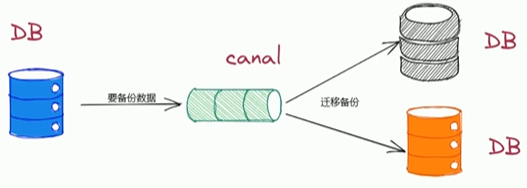
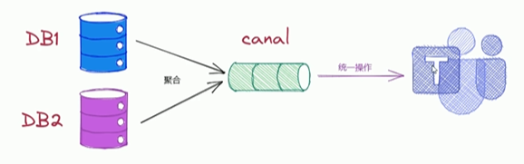

# Canal运用场景

1. 数据同步

   Canal可以帮助用户进行多种数据同步操作，如实时同步MySQL数据到ES，Redis等数据存储介质中

   

2. 数据库实时监控

   Canal可以实时监控MySQL的更新操作，对于铭感数据的修改可以及时通知相关人员。

   

3. 数据分析和挖掘

   Canal可以将MySQL增量数据投递到Kafka等消息队列中，为数据分析和挖掘提供数据来源。

   

4. 数据库备份

   Canal可以将MySQL主库上的数据增量日志复制到备库上，实现数据库备份。、

   

5. 数据集成

   Canal可以将多个MySQL数据库中的数据进行集成，为数据处理提供更加高效可靠的解决方案。

   

6. 数据库迁移

   Canal可以协助完成MySQL数据库的版本升级以及数据迁移任务

